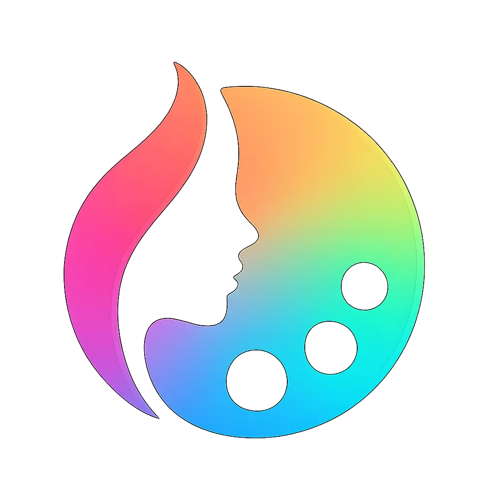
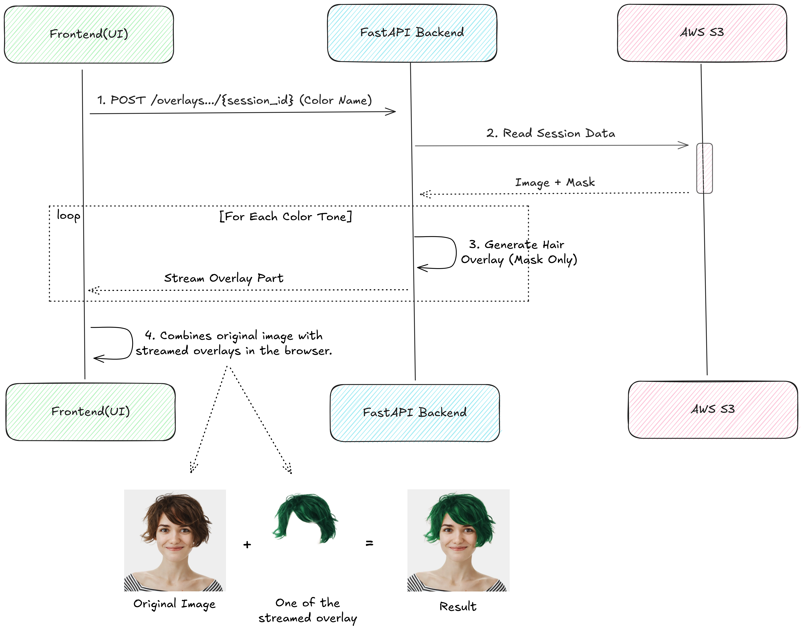
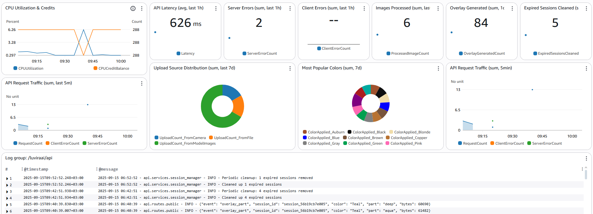
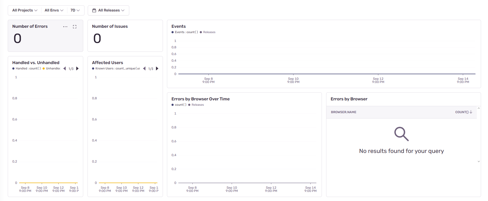
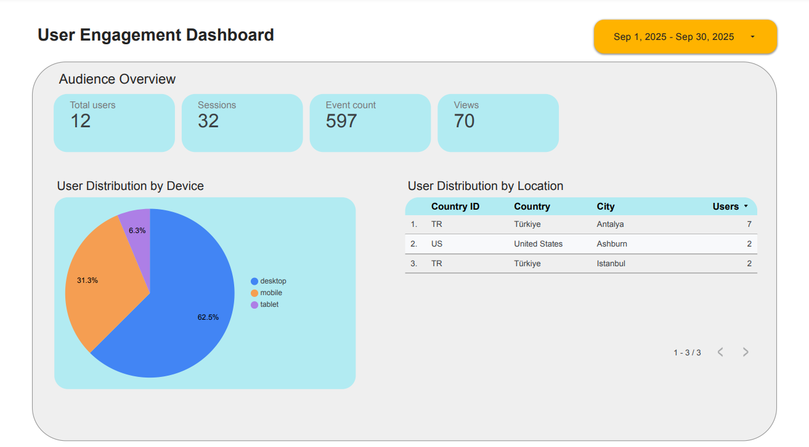
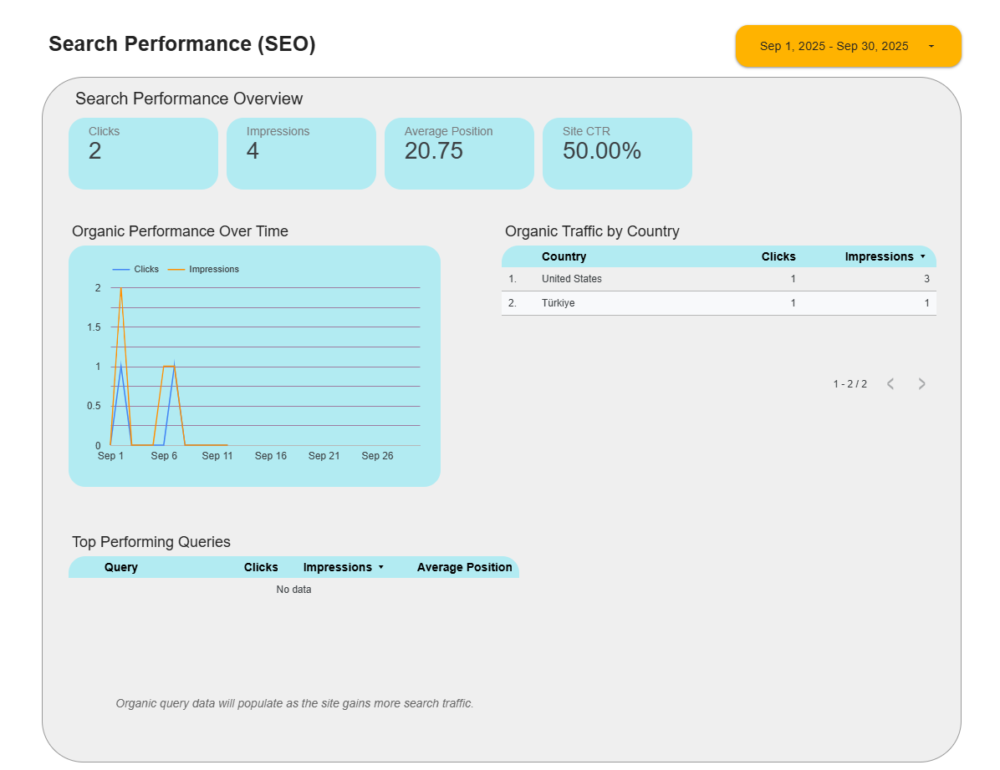
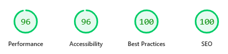
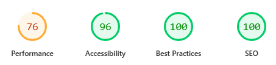

<div align="center">
  
  <h1>LuviraAI</h1>
  
  <p><strong>An AI-powered, full-stack application to virtually try on new hair colors in real-time.</strong></p>
  
  <!-- Badges -->
  <p>
    <a href="https://python.org"></a>
    <a href="https://fastapi.tiangolo.com"></a>
    <a href="https://vuejs.org"></a>
    <a href="https://github.com/tarik-oz/luvira-ai/blob/main/LICENSE"></a>                                                                                    
  </p>
  
  <!-- Important Links -->
  <p>
    <strong>
      <a href="https://luviraai.app">🌐 View Live Demo</a>
    </strong>
  </p>
</div>

Welcome to LuviraAI! This repository contains a production-grade, solo-developed application that uses a custom-trained deep learning model to provide realistic hair color transformations.

## 🎬 Live Demonstration

<div align="center">
  <video 
    src="https://github.com/user-attachments/assets/3a46cf73-a1e2-4ed2-957a-86102827e120" 
    muted 
    playsinline 
    controls 
    width="100%">
  </video>
  <em>(🎬 Click Play for a full demonstration of the desktop and mobile UI)</em>
</div>

## ✨ Core Features

- **AI-Powered Segmentation:** Utilizes a custom-trained **PyTorch** Attention U-Net model for highly accurate, real-time hair mask generation.
- **Realistic Color Transformation:** A proprietary algorithm processes images in HSV color space to preserve natural hair highlights and shadows.
- **High-Performance Streaming API:** Delivers multiple color tones in a single **multipart streaming response**, drastically reducing perceived latency and improving user experience.
- **Multiple Upload Options:** Supports image input from file upload, live camera capture, and a pre-selected gallery of sample models.
- **Full Observability:** Integrated with **Sentry**, **CloudWatch**, and **Looker Studio** for end-to-end monitoring of frontend errors, backend logs, and user analytics.

## 🏗️ System Architecture

<div align="center">
  
</div>

LuviraAI is built on a modern, decoupled full-stack architecture designed for scalability and maintainability.

- **Frontend:** A responsive SPA built with **Vue.js & TypeScript**, deployed on **Vercel** to leverage its global CDN.
- **Backend:** A powerful API built with **Python & FastAPI**, containerized with **Docker** and deployed on an **AWS EC2** instance.
- **Automation:** The backend has a full **CI/CD pipeline** using **GitHub Actions** for automated builds and deployments to AWS.
- **Observability:** The system's health is actively monitored with **Sentry** (frontend errors), **AWS CloudWatch** (backend logs & metrics), and **Looker Studio** (analytics).

## 🛠️ Tech Stack

<div align="center">
  <table>
    <tr>
      <td align="center"><strong>Backend & AI</strong></td>
      <td>FastAPI, Python, PyTorch, OpenCV</td>
    </tr>
    <tr>
      <td align="center"><strong>Frontend</strong></td>
      <td>Vue.js, TypeScript, Vite, Tailwind CSS, daisyUI</td>
    </tr>
    <tr>
      <td align="center"><strong>DevOps & Cloud</strong></td>
      <td>Docker, Docker Hub, CI/CD (GitHub Actions), AWS (EC2, S3, IAM, CloudWatch, SSM), Vercel</td>
    </tr>
     <tr>
      <td align="center"><strong>Observability</strong></td>
      <td>Sentry, Looker Studio (GA/GSC), AWS CloudWatch</td>
    </tr>
  </table>
</div>

## 🔄 Core API Workflow

<div align="center">
  
  <p><em>This diagram showcases the streaming optimization: after a single segmentation, the API streams only the lightweight hair masks, which are then combined with the original image on the client-side.</em></p>
</div>

_For a detailed look at all API workflows, see the [API's README](./api/README.md)._

## 📊 Live Dashboards

This project's health and usage are actively monitored. Below are screenshots of the live dashboards.

<div align="center">
  
</div>
<div align="center">
  
  <p><em>Real-time backend/infrastructure monitoring with CloudWatch and frontend error tracking with Sentry.</em></p>
</div>
<div align="center">
  
</div>
<div align="center">
  
  <p><em>User engagement and SEO performance analysis via Looker Studio. (<a href="https://lookerstudio.google.com/reporting/f0f1d235-1544-4101-a7ee-21ab2ebdd26a">View Live Dashboard</a>)</em></p>
</div>

## ⚡ Performance & Quality

<div align="center">
  
  <p><b>Desktop Performance</b>: Optimized for speed with excellent Core Web Vitals scores.</p>
  
  <p><b>Mobile Performance</b>: Intentionally showcases rich hair color samples and high-quality previews, prioritizing visual fidelity over pure performance metrics for the best user experience in beauty applications.</p>
</div>

## 🚀 Getting Started

Ready to run the project locally? It's easy with Docker.

1.  **Clone the Repository**
    ```bash
    git clone https://github.com/tarik-oz/luvira-ai.git
    cd luvira-ai
    ```
2.  **Download Model Files**
    Download the `luviraai-model.zip` archive from **[Hugging Face](https://huggingface.co/tarik-oz/luviraai-hair-segmentation)**. Extract it and place the two files inside into the `model/trained_models/` directory.

3.  **Run with Docker Compose**
    ```bash
    docker-compose up --build
    ```
    - **Frontend**: `http://localhost:5173`
    - **API Docs**: `http://localhost:8000/docs`

## 📁 Project Structure

For more details on a specific part of the project, check out its dedicated `README`:

- **[🚀 API Backend](./api/README.md)** - Endpoints, security, and local setup.
- **[💻 Frontend](./frontend/README.md)** - Vue components and state management.
- **[🤖 AI Model](./model/README.md)** - Model architecture, training scripts, and CLI usage.
- **[🎨 Color Algorithm](./color_changer/README.md)** - Details of the colorization logic.

## 📄 License

This project is licensed under the Apache 2.0 License. See the [LICENSE](./LICENSE) file for details.
