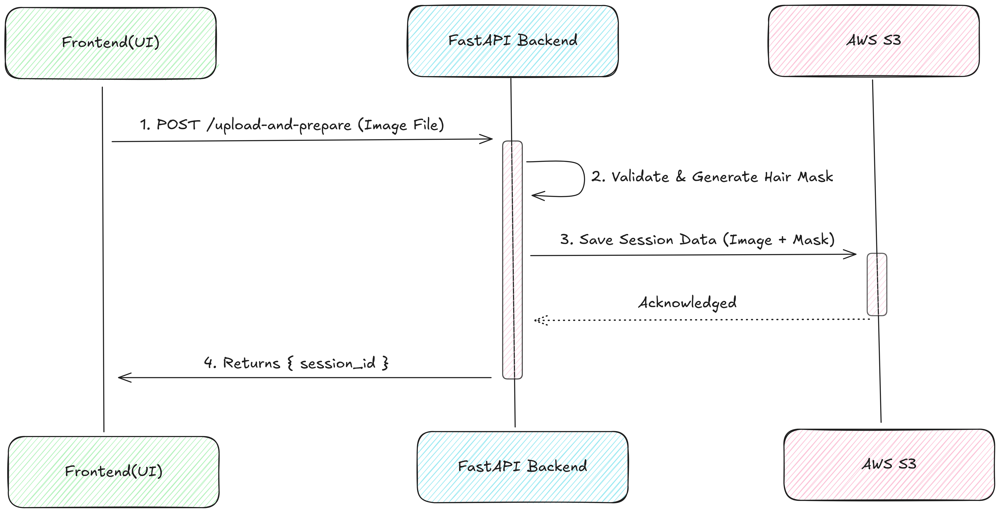
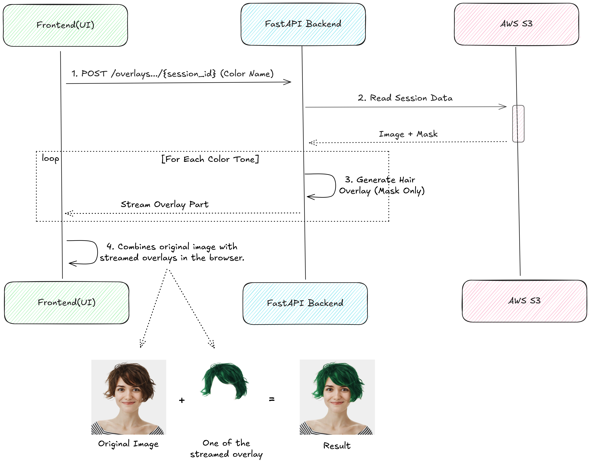

# FastAPI Backend

This module contains the FastAPI backend for the hair segmentation service. It provides RESTful endpoints for hair mask prediction, color transformation, session management, and health monitoring.

## 📋 Table of Contents

- [Setup](#setup)
- [API Architecture](#api-architecture)
- [Local Development](#local-development)
- [API Endpoints](#api-endpoints)
- [Configuration](#configuration)
- [Session Management](#session-management)
- [Error Handling](#error-handling)
- [Testing](#testing)
- [Deployment](#deployment)

## 🚀 Setup

### Prerequisites

- Python 3.10+
- Virtual environment (recommended)

### 1. Create Virtual Environment

```bash
# Navigate to project root
cd deep-learning-hair-segmentation

# Create virtual environment
python -m venv venv

# Activate virtual environment
# Windows
venv\Scripts\activate
# Linux/Mac
source venv/bin/activate
```

### 2. Install Dependencies

```bash
# Install all dependencies
pip install -r requirements.txt

# Or install API-specific dependencies only
pip install fastapi uvicorn[standard] pydantic python-multipart opencv-python numpy
```

### 3. Model Setup (Required)

```bash
# Ensure you have a trained model available
# Default path: model/trained_models/2025-08-15_01-54-07/best_model.pth
# Or set custom path in api/config/settings.py
```

## 🏗️ API Architecture

### Component Overview

```
api/
├── config/              # Configuration management
│   ├── settings.py      # Environment-driven settings
│   └── logging_config.py # Structured logging
├── core/                # Core infrastructure
│   ├── dependencies.py  # Dependency injection
│   ├── exceptions.py    # Custom exceptions
│   ├── middleware.py    # Request/response middleware
│   └── exception_handlers.py # Global error handling
├── routes/              # API endpoints
│   ├── health.py        # Health check endpoints
│   ├── model.py         # Model management
│   ├── prediction.py    # Core prediction endpoints
│   ├── public.py        # Frontend-optimized endpoints
│   └── session.py       # Session management
├── services/            # Business logic layer
│   ├── model_service.py # Model loading and management
│   ├── prediction_service.py # Hair segmentation logic
│   ├── color_change_service.py # Color transformation
│   └── session_manager.py # Session and caching
├── schemas/             # Request/response models
│   └── dto.py           # Pydantic data models
└── utils/               # Utility functions
    ├── validators.py    # Input validation
    └── image_utils.py   # Image processing helpers
```

### Design Patterns

- **Dependency Injection**: Singleton services for model and business logic
- **Layered Architecture**: Routes → Services → Utils
- **Exception Hierarchy**: Custom exceptions with error codes
- **Middleware**: Logging, CORS, request tracking

## 💻 Local Development

### 1. Environment Configuration

Create `.env` file in the project root (optional):

```bash
# API Configuration
HOST=0.0.0.0
PORT=8000
RELOAD=true
LOG_LEVEL=debug

# Model Configuration
MODEL_LOCAL_PATH=model/trained_models/2025-08-15_01-54-07/best_model.pth
DEVICE_PREFERENCE=auto  # auto, cpu, cuda

# File Validation
MAX_FILE_SIZE=10485760  # 10MB
MAX_IMAGE_WIDTH=4096
MAX_IMAGE_HEIGHT=4096

# Session Configuration
SESSION_BACKEND=filesystem
SESSION_TIMEOUT_MINUTES=30
SESSION_CACHE_DIR=session_data
```

### 2. Start Development Server

```bash
# Start with uvicorn directly
uvicorn api.main:app --host 0.0.0.0 --port 8000 --reload

# Or use the provided script
python -m api.run_api

# Or start with Python module
python -c "import uvicorn; uvicorn.run('api.main:app', host='0.0.0.0', port=8000, reload=True)"
```

### 3. Verify API is Running

```bash
# Health check
curl http://localhost:8000/

# API documentation
open http://localhost:8000/docs

# Model status
curl http://localhost:8000/model-info
```

### 4. Development URLs

- **API Root**: http://localhost:8000/
- **Swagger UI**: http://localhost:8000/docs
- **ReDoc**: http://localhost:8000/redoc
- **Health Check**: http://localhost:8000/health

## 📊 API Endpoint Documentation

### Key API Workflows

The following diagrams illustrate the main API workflows and endpoints:

#### Upload and Prepare Workflow



The `/upload-and-prepare` endpoint is optimized for frontend applications:

1. **Single Upload**: User uploads image once
2. **Validation**: File size, format, and hair detection validation
3. **Mask Generation**: AI model generates hair segmentation mask
4. **Session Creation**: Image and mask cached for fast processing
5. **Session ID Return**: Frontend receives session ID for subsequent operations

#### Overlays with Session Workflow



The `/overlays-with-session/{session_id}` endpoint provides efficient batch processing:

1. **Session Validation**: Verify session exists and hasn't expired
2. **Base Color Generation**: Apply selected base color to cached image
3. **Tone Variations**: Generate all available tones for the color
4. **Streaming Response**: Return multipart WEBP stream for real-time preview
5. **Client Processing**: Frontend displays base + tone options instantly

This approach eliminates redundant mask generation and enables fast color trials.

## 🔗 API Endpoints

### Public Endpoints (Frontend-Optimized)

#### Upload and Prepare

```bash
# Upload image for processing
curl -X POST "http://localhost:8000/upload-and-prepare" \
  -F "file=@image.jpg" \
  -F "source=upload_section"

# Response: {"session_id": "session_abc123", "expires_in_minutes": 30}
```

#### Session-Based Color Change

```bash
# Change hair color using session
curl -X POST "http://localhost:8000/change-hair-color-with-session/session_abc123" \
  -F "color_name=Blonde" \
  -F "tone=golden" \
  --output colored_hair.png
```

#### Stream Overlays (All Tones)

```bash
# Get all color variations in multipart stream
curl "http://localhost:8000/overlays-with-session/session_abc123" \
  -F "color_name=Brown" \
  --output overlays.multipart
```

### Core Processing Endpoints

#### Mask Prediction

```bash
# Get hair mask only
curl -X POST "http://localhost:8000/predict-mask" \
  -F "file=@image.jpg" \
  --output hair_mask.png
```

#### Direct Color Change

```bash
# One-step color change (slower)
curl -X POST "http://localhost:8000/change-hair-color" \
  -F "file=@image.jpg" \
  -F "color_name=Red" \
  -F "tone=vibrant" \
  --output colored_result.png
```

### Information Endpoints

#### Available Colors

```bash
# Get all available colors
curl "http://localhost:8000/available-colors"

# Response: {"colors": ["Blonde", "Brown", "Black", ...], "count": 12}
```

#### Available Tones

```bash
# Get tones for specific color
curl "http://localhost:8000/available-tones/Blonde"

# Response: {"color": "Blonde", "tones": ["golden", "ash", "platinum"], "count": 3}
```

### Management Endpoints

#### Model Management

```bash
# Get model information
curl "http://localhost:8000/model-info"

# Reload model
curl -X POST "http://localhost:8000/reload-model" \
  -H "Content-Type: application/json" \
  -d '{"model_path": "path/to/new/model.pth"}'

# Clear model from memory
curl -X POST "http://localhost:8000/clear-model"
```

#### Session Management

```bash
# Get session statistics
curl "http://localhost:8000/session-stats"

# Cleanup specific session
curl -X DELETE "http://localhost:8000/cleanup-session/session_abc123"

# Cleanup all sessions
curl -X POST "http://localhost:8000/cleanup-all-sessions"
```

## ⚙️ Configuration

### Environment Variables Reference

````bash
# Server Configuration
HOST=0.0.0.0                    # Server host
PORT=8000                       # Server port
RELOAD=true                     # Enable auto-reload (development)
LOG_LEVEL=info                  # Logging level
APP_ENV=development             # Environment (development/production)

# CORS Configuration
CORS_ORIGINS=*                  # Allowed origins (comma-separated)
CORS_METHODS=*                  # Allowed methods
CORS_HEADERS=*                  # Allowed headers

# Model Configuration
MODEL_LOCAL_PATH=path/to/model.pth     # Local model path
MODEL_S3_URI=s3://bucket/model.pth     # S3 model URI (optional)
DEVICE_PREFERENCE=auto          # Device: auto, cpu, cuda
PREDICTION_TIMEOUT=30           # Prediction timeout (seconds)
COLOR_CHANGE_TIMEOUT=30         # Color change timeout (seconds)

# File Validation
MAX_FILE_SIZE=10485760          # Max upload size (bytes)
ALLOWED_IMAGE_TYPES=image/jpeg,image/png,image/jpg
MAX_FILENAME_LENGTH=255         # Max filename length
MIN_IMAGE_WIDTH=64              # Min image width
MIN_IMAGE_HEIGHT=64             # Min image height
MAX_IMAGE_WIDTH=4096            # Max image width
MAX_IMAGE_HEIGHT=4096           # Max image height

# Hair Detection Validation
HAIR_PRESENCE_PIXEL_THRESHOLD=35   # Pixel brightness threshold
MINIMAL_HAIR_RATIO=0.005        # Min hair ratio (0.5%)

# Session Configuration
SESSION_BACKEND=filesystem      # Backend: filesystem or s3
SESSION_CACHE_DIR=session_data  # Local cache directory
SESSION_TIMEOUT_MINUTES=30      # Session timeout
SESSION_CLEANUP_INTERVAL_MINUTES=10  # Cleanup frequency
AUTO_CLEANUP_ON_STARTUP=true    # Auto cleanup on start
AUTO_CLEANUP_ON_SHUTDOWN=true   # Auto cleanup on shutdown

### Configuration Files

#### API Settings (`api/config/settings.py`)

```python
# Update default values
API_CONFIG["port"] = 8080
FILE_VALIDATION["max_file_size"] = 20 * 1024 * 1024  # 20MB
MODEL_CONFIG["default_model_path"] = "custom/model/path.pth"
````

#### Logging Configuration (`api/config/logging_config.py`)

```python
# Logs are stored in logs/ directory
# - api.log: All API logs (DEBUG level)
# - error.log: Warnings and errors only
# - Console output: INFO level
```

## 💾 Session Management

### Session Lifecycle

1. **Upload**: `POST /upload-and-prepare` creates session with image + mask
2. **Processing**: Multiple color changes using session ID (fast)
3. **Expiration**: Sessions auto-expire after 30 minutes
4. **Cleanup**: Automatic cleanup every 10 minutes

### Session Backends

#### Filesystem (Development)

```bash
# Sessions stored locally
session_data/
├── session_abc123/
│   ├── image.npy         # Original image
│   ├── mask.npy          # Hair mask
│   └── metadata.json     # Session info
└── session_def456/
    └── ...
```

#### S3 (Production)

```bash
# Sessions stored in S3
s3://your-bucket/sessions/
├── session_abc123/
│   ├── image.npy
│   ├── mask.npy
│   └── metadata.json
└── session_def456/
    └── ...
```

### Session APIs

```bash
# Check session stats
curl "http://localhost:8000/session-stats"

# Manual session cleanup
curl -X DELETE "http://localhost:8000/cleanup-session/session_abc123"

# Emergency cleanup all
curl -X POST "http://localhost:8000/cleanup-all-sessions"
```

### Common Error Codes

#### File Validation Errors

- `FILE_VALIDATION_FAILED`: Invalid file format/size
- `IMAGE_PROCESSING_FAILED`: Image decode/processing error

#### Model Errors

- `MODEL_NOT_LOADED`: Model not available
- `MODEL_LOAD_FAILED`: Model loading error
- `PREDICTION_FAILED`: Prediction processing error

#### Session Errors

- `SESSION_EXPIRED`: Session not found or expired
- `NO_HAIR_DETECTED`: Insufficient hair area in image

#### Processing Errors

- `COLOR_VALIDATION_FAILED`: Invalid color/tone name
- `TIMEOUT_ERROR`: Operation timed out

### Error Handling Examples

```python
import requests

# Handle API errors
try:
    response = requests.post("http://localhost:8000/upload-and-prepare",
                           files={"file": open("image.jpg", "rb")})
    if response.status_code != 200:
        error_data = response.json()
        print(f"Error: {error_data['error_code']} - {error_data['detail']}")
except requests.exceptions.RequestException as e:
    print(f"Network error: {e}")
```

## 🧪 Testing

### Manual Testing

```bash
# Test health endpoint
curl http://localhost:8000/health

# Test model loading
curl http://localhost:8000/model-info

# Test file upload
curl -X POST "http://localhost:8000/upload-and-prepare" \
  -F "file=@test_image.jpg" \
  -F "source=upload_section"

# Test color list
curl "http://localhost:8000/available-colors"
```

### Load Testing

```bash
# Install httpie for easier testing
pip install httpie

# Test concurrent uploads
for i in {1..10}; do
  http --form POST localhost:8000/upload-and-prepare \
    file@test_image.jpg source=test &
done
wait

# Monitor session statistics
http GET localhost:8000/session-stats
```

### Development Testing

```bash
# Test with different file types
http --form POST localhost:8000/upload-and-prepare file@image.png source=test
http --form POST localhost:8000/upload-and-prepare file@image.jpeg source=test

# Test error conditions
http --form POST localhost:8000/upload-and-prepare file@large_file.jpg source=test
http --form POST localhost:8000/upload-and-prepare file@corrupted.jpg source=test

# Test session expiration
# (wait 30+ minutes and try to use old session_id)
```

#### Processing Timeouts

```bash
# Adjust processing timeouts
export PREDICTION_TIMEOUT=60
export COLOR_CHANGE_TIMEOUT=60

# For high-resolution images
export MAX_IMAGE_WIDTH=2048
export MAX_IMAGE_HEIGHT=2048
```

## 🔧 Troubleshooting

### Common Issues

#### 1. Model Not Loading

```bash
# Check model path
ls -la model/trained_models/2025-08-15_01-54-07/best_model.pth

# Check API configuration
curl http://localhost:8000/model-info

# Try reloading model
curl -X POST "http://localhost:8000/reload-model" \
  -H "Content-Type: application/json" \
  -d '{"model_path": "correct/path/to/model.pth"}'
```

#### 2. Session Errors

```bash
# Check session directory
ls -la session_data/

# Clear all sessions
curl -X POST "http://localhost:8000/cleanup-all-sessions"

# Check session stats
curl "http://localhost:8000/session-stats"
```

#### 3. Memory Issues

```bash
# Monitor memory usage
htop

# Reduce session timeout
export SESSION_TIMEOUT_MINUTES=10

# Clear sessions more frequently
export SESSION_CLEANUP_INTERVAL_MINUTES=5
```

#### 4. File Upload Issues

```bash
# Check file size limits
export MAX_FILE_SIZE=5242880  # 5MB

# Test with smaller image
curl -X POST "http://localhost:8000/upload-and-prepare" \
  -F "file=@small_image.jpg" \
  -F "source=test"
```

### Debug Mode

```bash
# Enable debug logging
export LOG_LEVEL=debug

# Restart API
python -m api.run_api

# Check logs
tail -f logs/api.log
```

### Performance Profiling

```bash
# Install profiling tools
pip install py-spy

# Profile running API
py-spy record -o profile.svg --pid $(pgrep -f "api.main:app")

# View profile
open profile.svg
```

---

For more information, see the main project [README](../README.md) or contact the development team.
